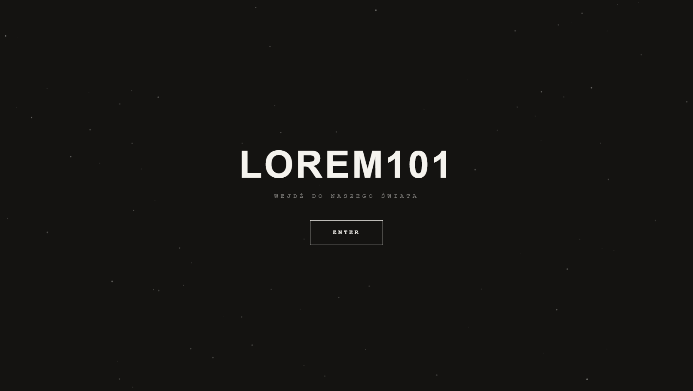
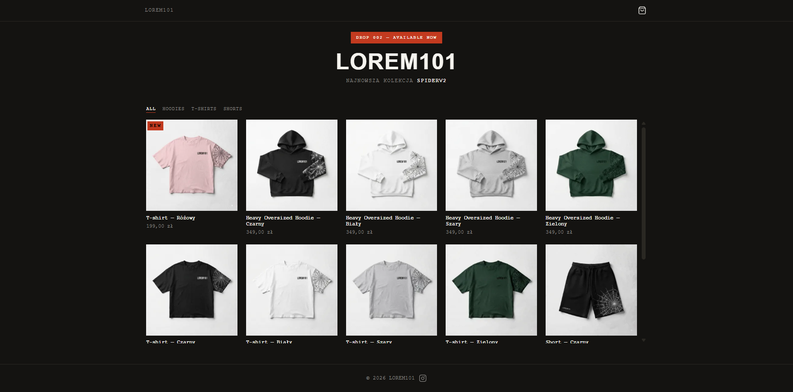
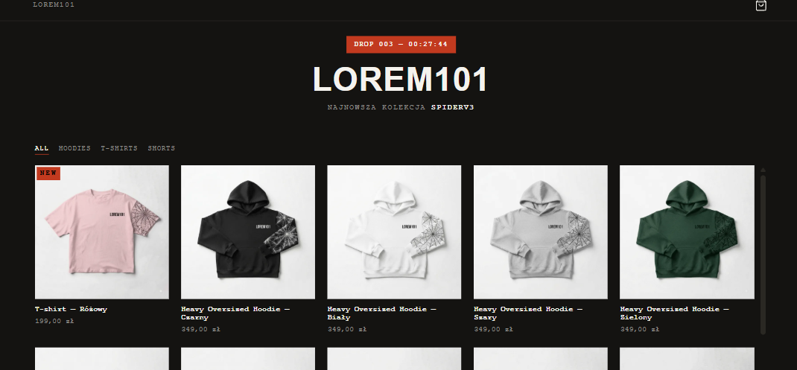
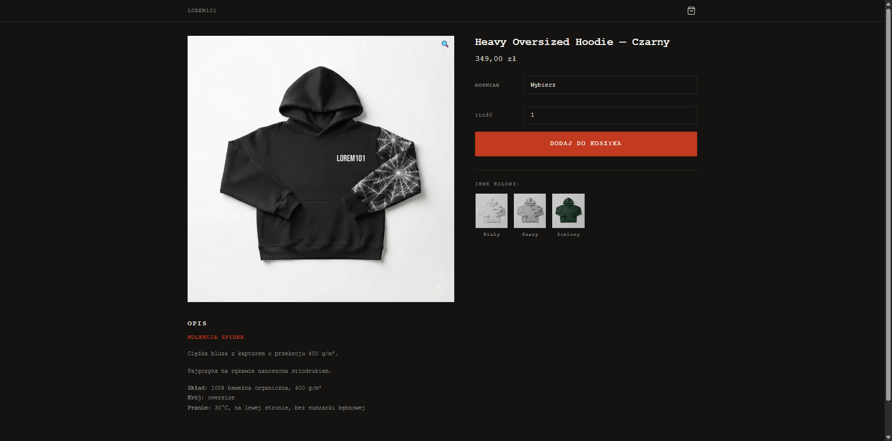
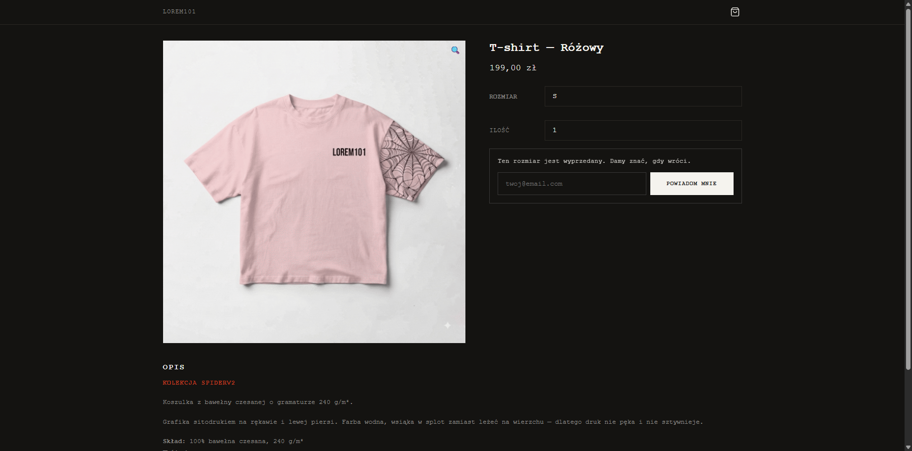
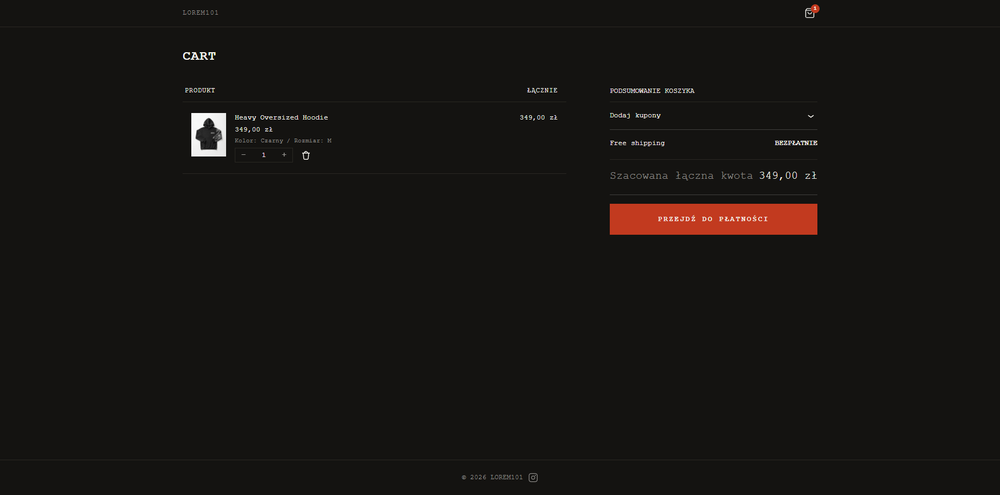
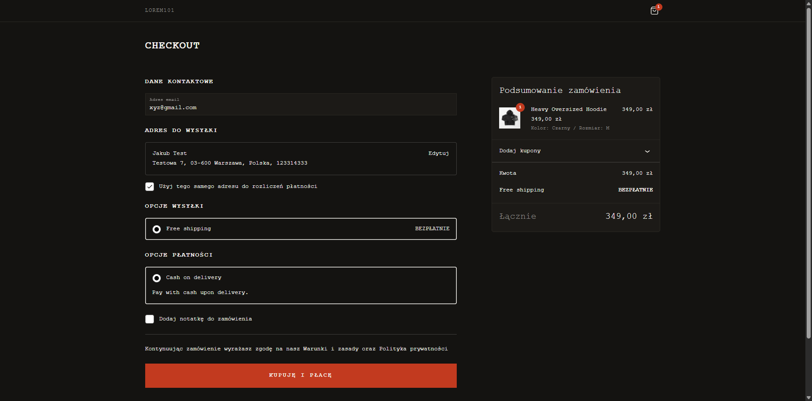
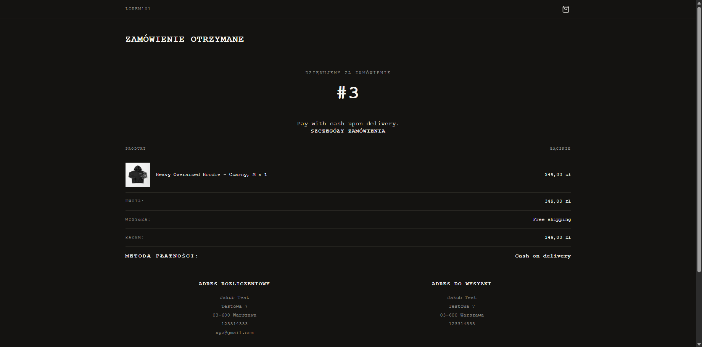
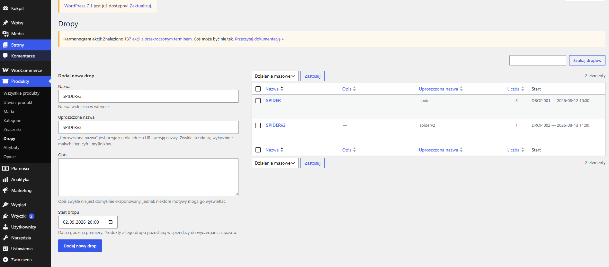
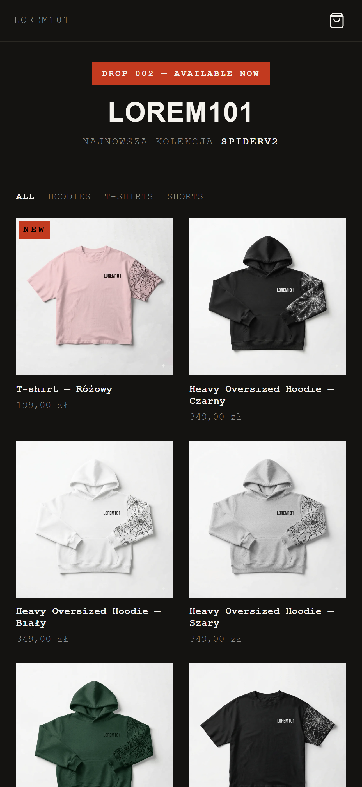

# PROJECT LOREM101 — sklep z limitowanymi dropami

Sklep internetowy do **portfolio** bazowany na markach streetwearowych. Zbudowany od zera na WordPressie i WooCommerce. Bez page builderów, bez gotowych motywów — własny motyw, trzy
własne wtyczki, własne endpointy REST.


---

## Screenshoty


### Ekran wejściowy



### Strona główna



### Odliczanie do premiery



### Karta produktu



### Wyprzedany wariant i zapis na powiadomienie



### Koszyk



### Checkout



### Potwierdzenie zamówienia



### Panel: zarządzanie dropami



### Widok mobilny



---

## Stack

| Warstwa | Technologia |
|---|---|
| Backend | WordPress, WooCommerce, PHP 8.2 |
| Frontend | SCSS (metodyka BEM), JavaScript (bez frameworka) |
| Build | Vite |
| Środowisko | Docker Compose (WordPress + MySQL + WP-CLI) |
| API | WordPress REST API — własne endpointy |

Świadomie bez frameworka frontendowego: sklep to kilkanaście interakcji,
a React czy Vue kosztowałyby więcej niż dają. Cały JavaScript to około
600 linii bez zależności.

---

## Funkcjonalności

### Sklep

- **Kafelek na każdą kolorystykę** — produkt zmienny z czterema kolorami daje
  cztery kafelki w siatce, każdy z własnym zdjęciem, jak u marek streetwear.
- **Filtrowanie kategorii bez przeładowania** — po stronie przeglądarki,
  na klasach, które WooCommerce i tak dokłada do kafelków.
- **Galeria pokazuje wybraną kolorystykę** — zdjęcia trzymane są na poziomie
  wariacji, bo przy czterech kolorach nie ma sensownego zdjęcia „ogólnego".
- **Dodawanie do koszyka bez przeładowania** — własny endpoint REST,
  licznik w nagłówku aktualizowany na miejscu.
- **Komunikat o stanie tylko wtedy, gdy coś znaczy** — „zostały 3 sztuki"
  buduje presję, „jest dostępne" to szum.

### LOREM101 Drop Manager

Wtyczka do prowadzenia limitowanych kolekcji.

- Dropy jako taksonomia — jedna data startu dla całej kolekcji, produkty
  przypisywane jak kategorie.
- **Automatyczna numeracja** (DROP 001, 002…) wyliczana z kolejności
  chronologicznej, bez przechowywania w bazie.
- **Ukrywanie przed premierą** — produkty nadchodzącego dropu są niewidoczne
  w katalogu, wyszukiwarce i REST API. Efekt zaskoczenia zamiast
  „dostępne od czwartku".
- **Odliczanie** w nagłówku strony głównej, po premierze automatyczne
  przeładowanie.
- **Blokada zakupu po stronie serwera** — ukrycie produktu nie wystarczy,
  bo żądanie da się podrobić.

### LOREM101 Restock Notifier

Zbieranie zgłoszeń o powrót wyprzedanych wariantów.

- Formularz pojawia się dopiero po wybraniu wariantu bez towaru.
- **Własna tabela w bazie** z warunkiem unikalności (jeden adres na wariant)
  i indeksami — post meta nie poradziłoby sobie z liczeniem i filtrowaniem.
- **Automatyczna wysyłka** po uzupełnieniu magazynu, wykrywana hookiem
  zmiany stanu.
- Panel w administracji: ile osób czeka na który wariant — konkretna
  informacja, czego dorobić w kolejnej serii.

### LOREM101 Demo Mode

Tryb prezentacyjny (domyślnie nieaktywny). Pozwala przejść cały proces
zakupowy, ale blokuje finalizację. Do włączenia, gdyby sklep stanął pod
publicznym adresem.

### Dodatkowe informacje

- **SEO** — meta description, Open Graph, canonical dla wariantów
  kolorystycznych (ten sam produkt pod kilkoma adresami to dla wyszukiwarki
  duplikat).
- **Mobile-first** — wyłącznie `min-width` w regułach responsywnych.
- **Dostępność** — respektowanie systemowego ustawienia ograniczania animacji,
  etykiety dla czytników ekranu, poprawna semantyka nagłówków.
- **Automatyczna konwersja zdjęć do WebP** — każde wgrane zdjęcie produktu
  dostaje odpowiednik `.webp` przy uploadzie (wszystkie rozmiary naraz),
  serwowany zamiast PNG/JPG tam, gdzie istnieje. Zero zmian w panelu,
  zero ręcznej pracy przy każdym nowym produkcie.
- **Własna numeracja zamówień** — WordPress przydziela identyfikatory ze
  wspólnej puli, więc pierwsze zamówienie dostawało numer 95.

---

## Struktura repozytorium

```
lorem101-streetwear-commerce/
├── theme/lorem101-theme/              # motyw
│   ├── inc/                           # logika PHP w podziale na obszary
│   ├── woocommerce/                   # nadpisane szablony WooCommerce
│   ├── template-parts/                # fragmenty szablonów
│   └── src/                           # SCSS i JavaScript (źródła dla Vite)
├── plugins/
│   ├── lorem101-drop-manager/         # limitowane kolekcje
│   ├── lorem101-restock-notifier/     # powiadomienia o dostępności
│   └── lorem101-demo-mode/            # blokada zamówień w prezentacji
├── assets/screenshots/
├── docker-compose.yml
└── README.md
```

---

## Uruchomienie

Wymagania: Docker Desktop, Node.js 18 lub nowszy.

### 1. Środowisko

```bash
git clone <adres-repozytorium>
cd lorem101-streetwear-commerce
cp .env.example .env
docker compose up -d
```

Wejdź na `http://localhost:8080` i przejdź instalator WordPressa.

> **Uwaga o uprawnieniach:** obrazy `wordpress` (Debian) i `wordpress:cli`
> (Alpine) używają różnych identyfikatorów użytkownika `www-data` — 33 kontra 82.
> Bez wyrównania WP-CLI dostaje „Permission denied". `docker-compose.yml`
> zawiera jednorazowy kontener `permissions-fix`, który robi to automatycznie
> przy każdym starcie.

### 2. Wtyczki i motyw

```bash
docker compose exec wpcli wp plugin install woocommerce --activate
docker compose exec wpcli wp theme activate lorem101-theme
docker compose exec wpcli wp plugin activate lorem101-drop-manager
docker compose exec wpcli wp plugin activate lorem101-restock-notifier
```

> `lorem101-restock-notifier` tworzy własną tabelę przy aktywacji — musi
> zostać włączona przez WP-CLI lub panel, samo skopiowanie plików nie wystarczy.

### 3. Frontend

```bash
cd theme/lorem101-theme
npm install
npm run build      # wersja produkcyjna
```

Do pracy nad stylami:

```bash
npm run dev
docker compose exec wpcli wp config set LOREM101_VITE_DEV_SERVER true --raw
```

Tryb deweloperski podmienia style na żywo. Przed zrzutami ekranu i pomiarami
wydajności wyłącz go:

```bash
docker compose exec wpcli wp config delete LOREM101_VITE_DEV_SERVER
```

### 4. Ustawienia sklepu

W panelu WooCommerce:

- **Settings → Products → Inventory** → „Low stock threshold" na `20`
- **Settings → Payments** → włącz „Cash on delivery" (do testów; realne
  bramki płatności nie są skonfigurowane)

Atrybuty produktów muszą nazywać się **`kolor`** i **`rozmiar`** — kod szuka
ich po tych nazwach.

---

## Codzienna praca

Docker i Vite nie startują same:

```bash
# 1. Uruchom Docker Desktop, poczekaj na "Engine running"
# 2. W katalogu projektu:
docker compose up -d

# 3. W osobnej karcie terminala (zostaw otwartą):
cd theme/lorem101-theme && npm run dev

# 4. Twarde odświeżenie w przeglądarce: Ctrl+Shift+R
```

---

## Decyzje techniczne

**Dropy jako taksonomia, nie pola przy produkcie.** Pierwsza wersja trzymała
daty w meta produktu. Gdy okazało się, że kolekcja obejmuje wiele produktów
i ma własny numer, przepisałem to na taksonomię — data w jednym miejscu
zamiast duplikatu przy każdym produkcie.

**Status dropu liczony, nie zapisywany.** Wtyczka przechowuje samą datę startu.
Gdyby status siedział w bazie, potrzebowałaby zadania cyklicznego przełączającego
kolekcje — a WP-Cron odpala się przy odwiedzinach strony, nie o dokładnej
godzinie. Na sklepie bez ruchu premiera by się opóźniła.

**Własny endpoint zamiast Store API WooCommerce.** Store API nie wie o dropach
i przepuściłoby produkt przed premierą. Poza tym zwracamy dokładnie te dane,
których potrzebuje interfejs.

**Własna tabela dla powiadomień.** Potrzebny był warunek unikalności, indeksy
i liczenie — post meta przy setkach zapisów staje się nieporęczne.

**Nadpisania szablonów tylko tam, gdzie zmienia się struktura HTML.** Wszędzie
indziej hooki, bo nie psują się przy aktualizacji WooCommerce. Nadpisane
szablony zmieniają wyłącznie kontenery, treść nadal pochodzi z hooków — dzięki
temu wtyczki podpięte pod te punkty działają dalej.

---

## Wydajność

Pomiar Lighthouse na buildzie produkcyjnym (strona główna), niezalogowany,
bez rozszerzeń przeglądarki:

| Metryka | Wynik |
|---|---|
| Performance | 100 |
| Accessibility | 97 | 
| Best Practices | 96 |
| SEO | 100 |


---

## Znane ograniczenia

- **Checkout to blok Gutenberga**, więc dostosowany wyłącznie stylami — nowy
  checkout renderuje się w przeglądarce i nie korzysta z szablonów PHP.
  Powrót do klasycznego wymagałby zamiany bloku na shortcode.
- **Maile nie wychodzą lokalnie** — Docker nie ma serwera pocztowego.
  Powiadomienia o restocku zapisują się poprawnie, ale wysyłkę widać dopiero
  na serwerze z SMTP.
- **Odliczanie liczy według zegara przeglądarki.** Dostępność produktów
  sprawdza serwer, więc źle ustawiony zegar wpływa wyłącznie na wyświetlane
  liczby.
- **Brak testów automatycznych.**

---

